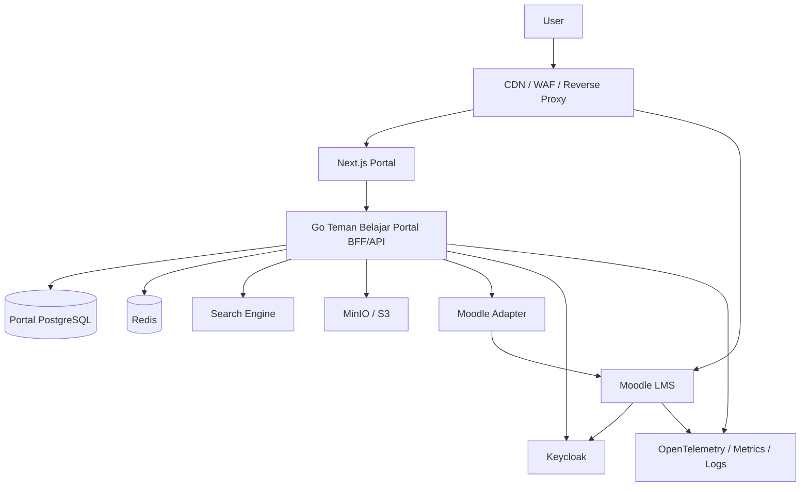
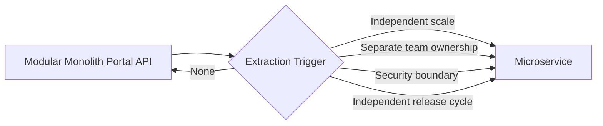

# 01 — Master Blueprint
## Teman Belajar — Enterprise Digital Learning Experience Platform

**Product:** Teman Belajar  
**Repository:** `teman-belajar`  
**Product Type:** Enterprise Digital Learning Experience Platform (LXP + LMS)

**Status:** Canonical  
**Version:** 1.0  
**Architecture:** Composable LXP + Moodle Learning Engine  
**Strategy:** Modular Monolith First → Selective Microservices

## 1. Tujuan

Membangun platform pembelajaran digital enterprise yang menggabungkan:
- portal publik modern;
- knowledge hub;
- content/media platform;
- personalized learning experience;
- Moodle sebagai LMS/learning engine;
- SSO terpusat;
- API-first integration;
- DevSecOps;
- agentic software engineering yang terkontrol.

## 2. Product Positioning

Produk bukan “theme Moodle”, tetapi **Learning Experience Platform (LXP) + LMS**.

### Experience Layer
Dimiliki portal:
- Homepage
- Berita
- Pengumuman
- Knowledge
- FAQ
- Gallery
- Video
- Agenda
- Search
- Course discovery
- My Learning dashboard
- Bookmark, rating, recommendation, notification
- Admin CMS

### Learning Engine
Dimiliki Moodle:
- Course
- Enrollment
- Lesson/activity
- Quiz/question bank
- Assignment
- Gradebook
- Completion
- Competency
- Badge
- Certificate
- SCORM
- H5P
- Forum

## 3. Architectural Principles

1. **Moodle is a Learning Engine, not the portal CMS.**
2. **No direct query to Moodle `mdl_*` tables.**
3. **No Moodle core modification.**
4. **API-first and contract-first.**
5. **Central identity via OIDC.**
6. **Portal and Moodle have separate data ownership.**
7. **Modular monolith before domain microservices.**
8. **Loose coupling and graceful degradation.**
9. **Secure-by-design.**
10. **Observability-by-default.**
11. **Documentation-as-code.**
12. **AI-assisted, human-governed engineering.**

## 4. Target Context Architecture

## 5. Target Technology Families

- Frontend: Next.js + React + TypeScript
- Backend: Go
- Portal DB: PostgreSQL
- Cache: Redis
- Identity: Keycloak/OIDC
- Learning Engine: Moodle
- Object Storage: MinIO/S3 compatible
- Search: Meilisearch initially; OpenSearch if enterprise search/analytics justifies it
- Reverse proxy: NGINX/Traefik
- Container: Docker
- Observability: OpenTelemetry + Prometheus/Grafana + centralized logs
- API: REST + OpenAPI 3.1
- CI/CD: GitHub Actions or equivalent
- Agentic engineering: Codex and/or Antigravity

## 6. Scope Release

### Foundation Release
- SSO
- public portal
- CMS
- knowledge hub
- gallery/video
- FAQ
- Moodle course discovery/integration
- learning dashboard
- search
- admin
- audit
- CI/CD
- observability

### Growth Release
- notification orchestration
- recommendation
- learning path
- gamification
- richer analytics
- mobile/PWA capability

### Intelligence Release
- semantic search
- RAG
- AI learning assistant
- personalized recommendations
- competency gap analysis
- AI-assisted content authoring

## 7. Non-Goals V1

V1 tidak:
- membangun quiz engine sendiri;
- membangun gradebook sendiri;
- membangun SCORM runtime sendiri;
- membuat puluhan microservice;
- mengganti Moodle dengan custom LMS;
- menggunakan database Moodle sebagai integration API;
- mengizinkan agent mengubah architecture tanpa ADR.

## 8. Quality Attributes

Prioritas:
1. Security
2. Maintainability
3. Availability
4. Interoperability
5. Usability
6. Performance
7. Scalability
8. Observability
9. Accessibility
10. Portability

## 9. Architecture Evolution

## 10. Governance

Architecture changes require:
- problem statement;
- alternatives;
- consequences;
- security impact;
- migration strategy;
- ADR approval.

`AGENTS.md` adalah policy operasional harian. Dokumen ini adalah product/architecture north star.

## 11. UI/UX Vendor Foundations

Teman Belajar menetapkan:
- **Techwind (Tailwind CSS)** sebagai visual foundation Public Portal dan Learner Experience.
- **Cuba (Tailwind CSS)** sebagai visual foundation Admin/Backoffice.

Vendor source adalah read-only reference. Product implementation berada di `apps/portal-web` dan `apps/admin-web`.

`shadcn/ui` tidak lagi menjadi default visual foundation; hanya boleh dipakai selektif bila tidak menciptakan visual language ketiga.
