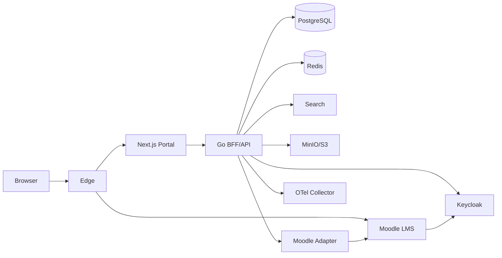

# 04 — System Design Document

**Product:** Teman Belajar  
**Repository:** `teman-belajar`  
**Product Type:** Enterprise Digital Learning Experience Platform (LXP + LMS)

**Status:** Canonical  
**Version:** 1.0

## 1. Component Model



## 2. Portal API Modules

- `identity`
- `profile`
- `content`
- `announcement`
- `knowledge`
- `media`
- `faq`
- `taxonomy`
- `navigation`
- `learning`
- `engagement`
- `search`
- `notification`
- `integration`
- `analytics`
- `audit`

### Internal layering
`transport -> application -> domain -> port -> adapter`

HTTP handler:
- parse;
- validate;
- authorize;
- invoke use case;
- map response.

Handler tidak boleh berisi domain decision.

## 3. Integration Patterns

### Synchronous
Untuk:
- course detail;
- current user learning summary bila cache miss;
- immediate admin query.

### Asynchronous
Untuk:
- search indexing;
- analytics;
- Moodle event synchronization;
- notification;
- media derivative generation.

### Outbox
Perubahan portal yang perlu event wajib menulis state + outbox dalam transaksi yang sama bila consistency dibutuhkan.

## 4. Resilience Policy

External dependency:
- connect timeout;
- request timeout;
- bounded retry;
- exponential backoff + jitter;
- circuit breaker bila justified;
- bulkhead/concurrency limit bila needed.

Tidak boleh infinite retry.

## 5. Caching

Cache kandidat:
- public menu;
- published homepage blocks;
- course catalogue snapshot;
- user learning summary short TTL;
- FAQ;
- taxonomy.

Cache tidak menjadi source of truth.

## 6. Runtime Topology

### Development
Docker Compose.

### Staging/Production
Dapat berupa:
- Docker/VM orchestration sederhana; atau
- Kubernetes bila skala/operasional membenarkan.

Kubernetes bukan prerequisite V1.

## 7. Deployment Separation

- Portal Web
- Admin Web (boleh satu codebase dengan route separation pada fase awal)
- Portal API
- Worker
- Moodle
- Keycloak
- PostgreSQL Portal
- PostgreSQL Moodle
- Redis
- Search
- Object Storage
- Observability

## 8. Failure Modes

| Failure | Expected Behavior |
|---|---|
| Moodle down | Portal public tetap hidup; learning widget degraded |
| Search down | Fallback navigasi/kategori; tampilkan error non-fatal |
| Redis down | API fallback ke DB dengan protection |
| Object storage down | Metadata tetap ada; media unavailable notice |
| IdP down | Public portal tetap hidup; login unavailable |
| DB portal down | API fail fast; alert critical |

## 9. Migration Strategy

- Expand-contract migration.
- Backward compatible API during rollout.
- Destructive operation memerlukan backup dan explicit approval.
- Integration mapping migration harus idempotent.

## 10. Scalability

Scale first:
1. CDN/static cache
2. Next.js replicas
3. API replicas
4. Redis/cache
5. DB tuning/read replicas if justified
6. Extract domain service only when evidence demands.

## 11. Security Boundaries

Public zone:
- CDN/WAF/reverse proxy

Application zone:
- Web/API/Moodle/Keycloak

Data zone:
- databases/cache/storage/search

Management zone:
- monitoring, CI runner, backup, administration

Network policy harus mengikuti least privilege.

## 12. UI Runtime Boundaries

```text
Techwind ORIGINAL (read-only)
        ↓ adapt
apps/portal-web
        ↓
Public + Learner Experience

Cuba ORIGINAL (read-only)
        ↓ adapt
apps/admin-web
        ↓
Admin Experience
```

Kedua aplikasi boleh berbagi contract dan neutral primitive, tetapi theme/CSS vendor tetap terisolasi.
