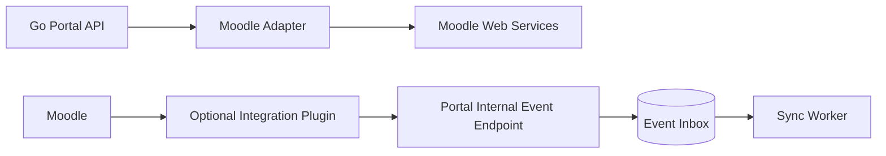

# 09 — Moodle Integration Specification

**Product:** Teman Belajar  
**Repository:** `teman-belajar`  
**Product Type:** Enterprise Digital Learning Experience Platform (LXP + LMS)

**Status:** Canonical  
**Version:** 1.0

## 1. Baseline

Pada 11 Agustus 2026:
- Moodle 5.2.2 adalah current stable.
- Moodle 5.3 direncanakan sebagai LTS pada 5 Oktober 2026.

Sebelum production go-live lakukan compatibility review terhadap supported LTS/current stable.

## 2. Golden Rules

1. No direct portal SQL to Moodle DB.
2. No Moodle core modification.
3. Gunakan official APIs/web services.
4. Jika core API tidak cukup, gunakan custom plugin dengan extension mechanism resmi.
5. Moodle-specific details terisolasi di adapter/plugin.
6. Integration harus observable dan resilient.

## 3. Integration Components

## 4. Identity Mapping

Mapping key:
- Keycloak subject (`sub`)
- portal user ID
- Moodle user ID

Mapping tidak boleh hanya berdasarkan display name.

Email dapat menjadi lookup/provisioning attribute sesuai policy, tetapi immutable identity key tetap disimpan.

## 5. JIT Provisioning

Flow:
1. User authenticated at IdP.
2. Portal obtains identity claim.
3. Moodle access requested.
4. Existing mapping checked.
5. User provision/update performed if policy allows.
6. Mapping persisted.
7. Audit written.
8. User continues to Moodle.

## 6. Read Models

Portal boleh menyimpan snapshot/cache:
- course catalogue;
- course summary;
- learner progress summary.

Untuk statistik, `local_temanbelajar_get_learning_analytics` menerima
`start_date` dan `end_date` inklusif (maksimum 365 hari) dan mengembalikan
agregat tanpa identitas. Pembelajar aktif adalah pengguna aktif dengan role
Moodle `student`, enrolment aktif pada course nyata, dan aktivitas course dalam
periode; guest, site admin, akun deleted/suspended, serta staf non-learner tidak
dihitung. Completion rate adalah completed eligible enrolments sampai akhir
periode dibagi eligible learner-course enrolments pada cohort yang sama. Role
`Portal Administrator` tidak otomatis memberi Moodle Site Administrator.

Snapshot harus menyimpan:
- source;
- external ID;
- synced_at;
- version/hash bila tersedia.

## 7. Events

Canonical event examples:
- `learning.user_enrolled`
- `learning.course_completed`
- `learning.activity_completed`
- `learning.badge_awarded`
- `learning.certificate_issued`
- `learning.course_updated`

Event envelope:
- event_id
- event_type
- occurred_at
- source
- subject_id
- payload
- schema_version

## 8. Idempotency

Inbox memiliki unique `event_id`.
Duplicate event = acknowledge safely, do not reapply side effect.

## 9. Timeout & Retry

- timeout explicit;
- retry only safe/idempotent request;
- no retry on validation/authorization failure;
- exponential backoff;
- max attempts bounded;
- dead-letter/manual reconciliation path.

## 10. SSO

Preferred:
- OIDC/OAuth2 integration through central IdP.
- Portal dan Moodle memiliki client/config yang terpisah.
- Logout semantics diuji untuk local session dan IdP session.

Kontrak implementasi:

1. Moodle memakai client `teman-belajar-moodle`; jangan memakai client Portal
   atau Admin dan jangan berbagi client secret.
2. Moodle formal-learning routes memulai OAuth2 secara otomatis melalui
   `local_temanbelajar/login.php`; recovery admin tetap tersedia melalui
   mekanisme administratif terkontrol, bukan tautan publik alternatif.
3. Logout dari Moodle memicu RP-Initiated Logout Keycloak dan kembali ke Portal
   publik setelah sesi IdP berakhir.
4. `local_temanbelajar/federated_logout.php` adalah receiver front-channel yang
   idempotent, memvalidasi issuer, tidak menyimpan token, dan mengirim
   `Cache-Control: no-store`.
5. Portal/Admin/Moodle tetap memiliki cookie lokal masing-masing. “Otomatis
   login” berarti aplikasi melakukan OIDC flow tanpa prompt ketika sesi
   Keycloak aktif; bukan membaca atau menyalin cookie aplikasi lain.

## 11. Plugin Policy

Custom plugin harus:
- memiliki namespace jelas;
- menggunakan Moodle APIs;
- tidak patch core;
- versioned;
- punya upgrade steps;
- punya automated test bila feasible;
- didokumentasikan kompatibilitas Moodle;
- punya minimal privilege.

## 12. Health & Reconciliation

Admin dapat melihat:
- last successful sync;
- failed sync count;
- Moodle latency;
- event backlog;
- mapping failures;
- retry/dead-letter.

Tidak menampilkan access token/secret.

## 13. Degraded Experience

Jika Moodle unavailable:
- public content tersedia;
- course data cached boleh ditampilkan dengan freshness indicator bila sesuai;
- action requiring Moodle dinonaktifkan dengan pesan jelas;
- alert dikirim ke operator.
