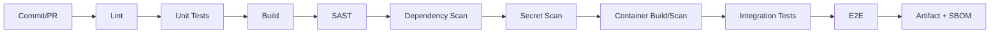
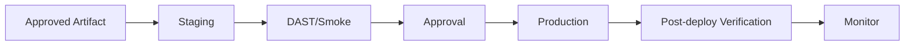

# 11 — DevSecOps & Infrastructure Blueprint

**Product:** Teman Belajar  
**Repository:** `teman-belajar`  
**Product Type:** Enterprise Digital Learning Experience Platform (LXP + LMS)

**Status:** Canonical  
**Version:** 1.0

## 1. Environments

- local
- development
- staging
- production
- optional UAT

No shared production credentials across environments.

## 2. CI Pipeline

## 3. CD Pipeline

## 4. Deployment

- immutable image;
- environment config externalized;
- health/readiness checks;
- rollback strategy;
- DB migration coordinated;
- no build on production host.

## 5. Observability

### Metrics
- request count;
- latency P50/P95/P99;
- error rate;
- saturation;
- DB pool;
- Redis;
- Moodle adapter latency/error;
- queue backlog;
- sync failures.

### Logs
Structured JSON:
- timestamp;
- level;
- service;
- environment;
- trace_id;
- request_id;
- actor_id where appropriate;
- event;
- message.

PII/secrets tidak boleh logged sembarangan.

### Traces
OpenTelemetry untuk request lintas portal → API → Moodle/infrastructure.

## 6. Alerting

Alert actionable:
- service unavailable;
- error rate spike;
- DB saturation;
- auth anomaly;
- Moodle integration sustained failure;
- queue/dead-letter backlog;
- backup failure.

## 7. Backup

Separate:
- portal DB;
- Moodle DB;
- Moodledata;
- Keycloak DB;
- object storage metadata/data;
- configuration/IaC.

Backup success bukan cukup: restore drill wajib periodik.

## 8. Recovery

Tetapkan sebelum production:
- RTO per service;
- RPO per datastore;
- recovery owner;
- recovery runbook;
- communication path.

## 9. Infrastructure as Code

Jika menggunakan IaC:
- version-controlled;
- reviewed;
- plan before apply;
- production apply protected.

## 10. Release Strategy

- semantic/release versioning policy;
- changelog;
- feature flag untuk risky feature;
- progressive/pilot rollout where practical;
- rollback tested.

## 11. Definition of Production Ready

- monitoring and alerts;
- backup/restore;
- secret rotation procedure;
- security scans;
- performance baseline;
- incident runbook;
- ownership/on-call path;
- dependency inventory/SBOM;
- documented rollback.

## 12. Commercial Vendor Source Handling

- Vendor `ORIGINAL/` source secara default Git-ignored.
- CI tidak boleh mengandalkan vendor source yang tidak diprovision secara resmi.
- Setelah komponen diadaptasi ke product code, build production tidak boleh memerlukan folder vendor original.
- Jangan menyimpan license key/purchase code pada CI secret kecuali benar-benar diperlukan dan disetujui.
